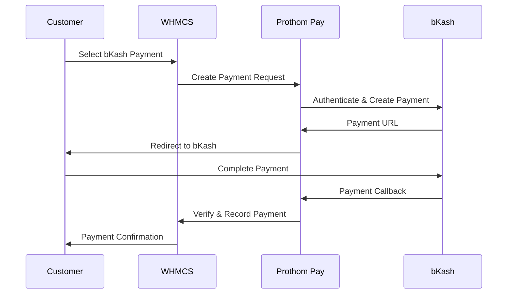

# Prothom Pay - bKash Gateway for WHMCS

A comprehensive bKash payment gateway integration for WHMCS that enables secure online payments through Bangladesh's leading mobile financial service.

## Overview

Prothom Pay is a robust WHMCS payment gateway module that integrates with bKash's Tokenized Checkout API, providing seamless payment processing for your WHMCS billing system. The module supports both sandbox and live environments with comprehensive logging and error handling.

## Features

- ✅ **Secure Payment Processing**: Full integration with bKash Tokenized Checkout API
- ✅ **Dual Environment Support**: Sandbox and production environments
- ✅ **Comprehensive Logging**: Debug logging for troubleshooting
- ✅ **Error Handling**: Robust error handling with user-friendly messages
- ✅ **Transaction Management**: Automatic payment verification and recording
- ✅ **Invoice Integration**: Seamless WHMCS invoice management
- ✅ **Currency Support**: BDT (Bangladeshi Taka) support
- ✅ **Security**: Input sanitization and validation
- ✅ **Retry Logic**: Automatic retry mechanisms for failed requests

## Requirements

- WHMCS 7.0 or higher
- PHP 7.4 or higher
- cURL extension enabled
- SSL certificate (required for production)
- Valid bKash merchant account

## Installation

1. **Download the module files** and extract them to your WHMCS installation directory:
   ```
   /modules/gateways/prothompay.php
   /modules/gateways/lib/ProthomPayClient.php
   /modules/gateways/lib/ProthomPayLogger.php
   /modules/gateways/callback/prothompay.php
   ```

2. **Set proper file permissions**:
   ```bash
   chmod 644 /modules/gateways/prothompay.php
   chmod 644 /modules/gateways/lib/*.php
   chmod 644 /modules/gateways/callback/prothompay.php
   ```

3. **Create log directory** (if it doesn't exist):
   ```bash
   mkdir -p /storage/logs
   chmod 755 /storage/logs
   ```

## Configuration

### 1. bKash Merchant Setup

Before configuring the module, ensure you have:
- Active bKash merchant account
- API credentials from bKash merchant dashboard
- Sandbox credentials for testing (optional)

### 2. WHMCS Configuration

1. **Navigate to** `Setup > Payments > Payment Gateways`
2. **Find** "Prothom Pay (bKash)" in the list
3. **Click** "Manage Existing Gateways" or "Add New Gateway"
4. **Configure the following settings**:

| Setting | Description | Required |
|---------|-------------|----------|
| **API Username** | Your bKash merchant username | Yes |
| **API Password** | Your bKash merchant password | Yes |
| **App Key** | Application key from bKash dashboard | Yes |
| **App Secret** | Application secret from bKash dashboard | Yes |
| **Sandbox Mode** | Enable for testing with sandbox credentials | No |
| **Enable Debug Logging** | Enable detailed logging for troubleshooting | No |

### 3. Testing Configuration

For testing, enable sandbox mode and use your sandbox credentials:

```php
// Example sandbox configuration
Sandbox Mode: Yes
API Username: [Your sandbox username]
API Password: [Your sandbox password]
App Key: [Your sandbox app key]
App Secret: [Your sandbox app secret]
```

## Usage

### Customer Payment Flow

1. **Customer** selects Prothom Pay as payment method
2. **System** validates credentials and creates payment request
3. **Customer** is redirected to bKash payment page
4. **Customer** completes payment using bKash app/web
5. **System** receives callback and verifies payment
6. **Invoice** is automatically marked as paid

### Payment Process



## API Reference

### ProthomPayClient Class

The main client class for interacting with bKash API.

#### Methods

##### `__construct($username, $password, $appKey, $appSecret, $baseUrl, $logger)`
Initialize the client with credentials and configuration.

##### `authenticate()`
Authenticate with bKash API and obtain access token.

##### `createPayment($invoiceId, $amount, $callbackUrl)`
Create a new payment request.

```php
$payment = $client->createPayment(
    $invoiceId,    // WHMCS invoice ID
    $amount,       // Payment amount
    $callbackUrl   // Callback URL for payment verification
);
```

##### `queryPayment($paymentID)`
Query payment status by payment ID.

```php
$status = $client->queryPayment($paymentID);
```

### ProthomPayLogger Class

Handles logging functionality for debugging and monitoring.

#### Methods

##### `log($message, $context = [])`
Log a message with optional context data.

##### `getLogs($lines = 100)`
Retrieve recent log entries.

## Error Handling

The module includes comprehensive error handling:

### Common Error Codes

| Error | Description | Solution |
|-------|-------------|----------|
| `AUTH_ERROR` | Authentication failed | Verify credentials |
| `INVALID_AMOUNT` | Amount validation failed | Check invoice amount |
| `PAYMENT_FAILED` | Payment processing failed | Check bKash account status |
| `NETWORK_ERROR` | Connection issues | Check internet connectivity |

### Error Responses

```php
// Example error response
{
    "status": "error",
    "message": "Authentication failed",
    "error_code": "AUTH_ERROR",
    "timestamp": "2024-01-01 12:00:00"
}
```

## Logging

### Log Levels

- **Info**: General information and successful operations
- **Warning**: Non-critical issues
- **Error**: Critical errors and failures
- **Debug**: Detailed debugging information

### Log Location

Logs are stored in `/storage/logs/prothompay.log`

### Log Format

```
[2024-01-01 12:00:00] Message Content {
    "context": "data",
    "additional": "information"
}
```

## Security Considerations

1. **Credential Protection**: Never expose API credentials in client-side code
2. **SSL/TLS**: Always use HTTPS in production
3. **Input Validation**: All inputs are sanitized and validated
4. **Token Management**: Access tokens are securely managed with expiration
5. **Callback Security**: Payment callbacks are verified for authenticity

## Troubleshooting

### Common Issues

#### 1. Authentication Failures
```
Error: Authentication failed
Solution: Verify API credentials in bKash merchant dashboard
```

#### 2. Payment Creation Fails
```
Error: Payment creation failed
Solution: Check merchant account status and API limits
```

#### 3. Callback Issues
```
Error: Payment callback not received
Solution: Verify callback URL accessibility and SSL certificate
```

#### 4. Amount Mismatches
```
Error: Amount mismatch
Solution: Check currency conversion and fee calculations
```

### Debug Mode

Enable debug logging to troubleshoot issues:

1. Set "Enable Debug Logging" to "Yes"
2. Reproduce the issue
3. Check logs at `/storage/logs/prothompay.log`
4. Look for error messages and API responses

### Log Analysis

```bash
# View recent logs
tail -f /storage/logs/prothompay.log

# Search for specific errors
grep -i "error" /storage/logs/prothompay.log

# Filter by date
grep "2024-01-01" /storage/logs/prothompay.log
```

## Testing

### Sandbox Testing

1. **Enable** sandbox mode in configuration
2. **Use** sandbox credentials from bKash
3. **Test** payment flow with small amounts
4. **Verify** callback processing

### Test Scenarios

- [ ] Successful payment flow
- [ ] Payment cancellation
- [ ] Network timeout handling
- [ ] Invalid credentials
- [ ] Amount validation
- [ ] Callback verification

## Performance Optimization

### Recommendations

1. **Enable** caching for authentication tokens
2. **Implement** connection pooling for API calls
3. **Use** async processing for callbacks
4. **Monitor** API response times
5. **Optimize** database queries

### Monitoring

Monitor the following metrics:
- Payment success rate
- API response times
- Authentication failures
- Callback processing time

## Changelog

### Version 1.1.0
- Enhanced error handling and logging
- Improved authentication flow
- Added retry mechanisms
- Better input sanitization
- Updated API endpoints

### Version 1.0.0
- Initial release
- Basic bKash integration
- Payment processing
- Callback handling

## Support

### Developer Contact

**Name**: Mehedi Hasan  
**Email**: mehedihasan2002.myc@gmail.com  
**Phone**: +8801601300220  

### Getting Help

1. **Check** this documentation first
2. **Review** log files for error details
3. **Contact** developer for technical support
4. **Provide** relevant log entries when reporting issues

### Reporting Issues

When reporting issues, please include:
- WHMCS version
- PHP version
- Error messages from logs
- Steps to reproduce the issue
- Expected vs actual behavior

## License

This project is licensed under the MIT License. See the LICENSE file for details.

## Contributing

Contributions are welcome! Please:
1. Fork the repository
2. Create a feature branch
3. Make your changes
4. Add tests if applicable
5. Submit a pull request

## Acknowledgments

- bKash for providing the payment gateway API
- WHMCS for the billing platform
- PHP community for excellent libraries and tools

---

**Note**: This module is not officially endorsed by bKash or WHMCS. It's a third-party integration developed to facilitate bKash payments in WHMCS.